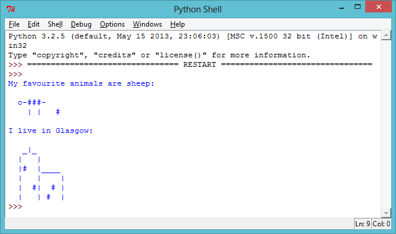

---
title: ASCII Art
level: Python 1
language: en
stylesheet: python
embeds: "*.png"
materials: ["Project Resources/*.*"]
beta: true
...

#Introduction:  { .intro}

Python allows you to turn a series of instructions into useful programs and fun games! In this project you’ll learn how to run a Python program, and how to print text to the screen.

#Step 1: Saying hello { .activity}
## Activity Checklist { .check}

+ Let’s start by writing a very simple program, just so that you know how to get a Python program running. Open the IDLE program editor:
    + On Windows, find IDLE in the start menu;
    + On Mac, open up Terminal.app and type `idle` and press enter;
    + On Linux, open up a Terminal, and type `idle` and press enter.

+ Click `File → New Window`, and type the following into the window that appears:

    ```{.language-python}
    print("Hello, how are you?")
    ```

    This program will print some text to the screen. Notice that the text you want to print is surrounded by speech marks (`"`). Here's an image showing what you need to do:

    

+ Save the file, by clicking `File → Save`, and name the file `hello.py` or something similar. Don’t forget to type the `.py` bit at the end, which tells the computer that it’s a Python file. Without it, your program won't be colour coded, which can be really helpful.

    

+ Run the file by clicking `Run → Run Module`. You should see another window appear, which is the Python shell. This is the place that your program will run. If everything has worked properly, you should see your text printed to the screen.

    

+ If you’ve made a mistake, for example missing out a speech mark (`"`), then you’ll get an error message instead, telling you what went wrong! Try it!

    

+ Congratulations, you are now officially a Python programmer! Give yourself a pat on the back (or if you're feeling lazy, get someone else to do it for you).

## Challenge: What’s on your mind? { .challenge}
Change the program above to print something more interesting to the screen!


#Step 2: About yourself { .activity .new-page}
## Activity Checklist { .check}

+ Let’s print something much more fun than text… ASCII art! ASCII art is creating pictures out of text. Here’s an example - it’s meant to be a dog!

    

    To make this masterpiece, you can type the following into the IDLE editor and run the program:

    ```{.language-python}
    print("A picture of a dog...")
    print(" 0____  ")
    print("  ||||  ")
    ```

+ If you prefer, you can use 3 single quotes (`'''`) instead of speech marks, which allows you to print multiple lines of text with 1 print statement. Like this:

    ```{.language-python}
    print('''
    A picture of a dog...
     0____
      ||||
    ''')
    ```

    If you run this program, you’ll see it prints the same dog as before.

## Challenge: About yourself { .challenge}
Write a Python program to tell others about yourself, by using text and ASCII art. You can create images of your hobbies, friends, family… anything you want! Here’s an example:



#Step 3: Calculating text { .activity}
## Activity Checklist { .check}

+ Python can also do calculations using text! What do you get if you multiply `"hello"` by 5? Let’s ask Python, by running this program:

    ```{.language-python}
    print("hello" * 5)
    ```

    The star `*` in the program above is a multiply sign. Run the program above, and you should see the answer:

    

+ You can make the printed text above easier to read, by putting a space after the word `"hello"` in your program:

    ```{.language-python}
    print("hello " * 5)
    ```

    Run this program and you'll see that the output is a little easier to read than before.

+ If `"hello "` multiplied by 5 is `"hello hello hello hello hello "`, then what is `"hello" - 7`? Does this calculation even make sense?

    

    Oops, you've broken it! Instead of an answer, we get an error message. It looks like that calculation doesn’t make sense in Python!

+ How about addition? What answer do you think `"hello " +  "world`" would give? Try it out, by running the following program:

    ```{.language-python}
    print("hello " + "world")
    ```

    

    Does it give you the answer you expected?

## Challenge: Words and numbers { .challenge}
What does the following program print to the screen? See if you can guess correctly before running the program.

```{.language-python}
print("ha "*4)
print("ba" + "na"*2)
print("He" + "l"*2 + "o" + "!"*10)
```

Can you make up any words of your own?

#Step 4: ASCII patterns { .activity}
## Activity Checklist { .check}

+ Now that you know how to do calculations on text, now what? Why is it useful? Well, let’s say you wanted to draw an ASCII art rectangle that is 30 characters long and 3 characters high. You could either draw it the hard way, like this:

    ```{.language-python}
    print("##############################")
    print("##############################")
    print("##############################")
    ```

    Or you could save time and draw it the easy way, like this:

    ```{.language-python}
    print("#" * 30)
    print("#" * 30)
    print("#" * 30)
    ```

    Both give you exactly the same rectangle printed to the screen:

    

+ You could even use calculations to make interesting patterns, like this wave:

    ```{.language-python}
    print("/\  "*10)
    print("  \/"*10)
    ```

    

## Challenge: Code a scarf { .challenge}
Your best friend is having an 11th birthday party, and as a gift you've decided to code them a scarf! Use calculations wherever possible to make your own scarf pattern.

If you're feeling generous, you could even code them a cake (including 11 candles) to go with it!


