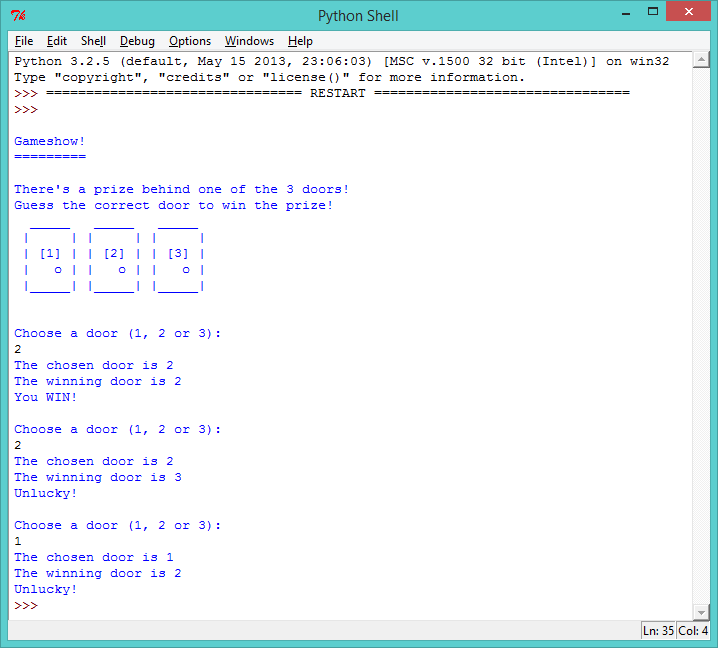
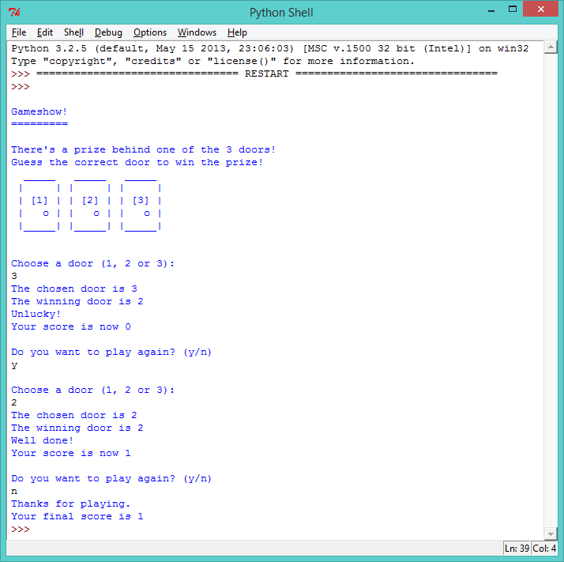
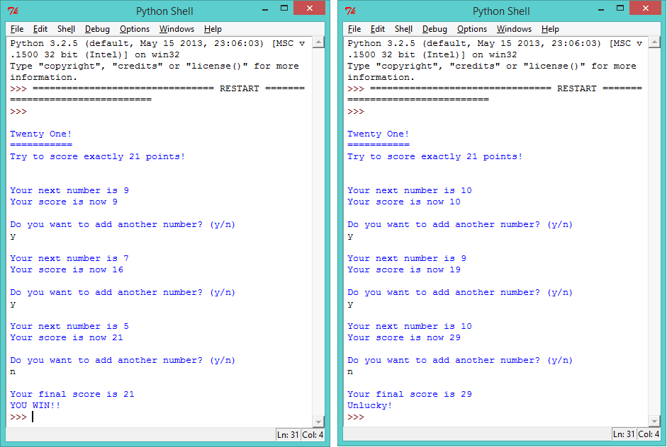

---
title: (Beta) Gameshow
level: Level 1
language: en
stylesheet: python
embeds: "*.png"
materials: ["Gameshow.py"]
...

#Heads up! { .beta}
This project is in Beta. That means we're still testing it, and there's a small chance there could be some bugs or typos. If you're a club leader trying out this project, please complete <a href="https://docs.google.com/forms/d/1eMCfpYe3v7eYu5M8rSqLKlmq7cczLCLHx66csgyUyVU/viewform?usp=send_form" target="_blank">this short questionnaire</a> (or email projects@codeclub.org.uk) to let us know how it went!

#Introduction:  { .intro}

As well as using `for` loops to repeat commands a set number of times, a `while` loop can also be used to repeat commands _until something happens in your program_.

#Step 1: What's behind the door? { .activity}
## Activity Checklist { .check}

+ Imagine a gameshow, where there is an amazing prize behind one of 3 doors. If you pick the correct door, you win the prize! Pick the wrong door, and you get nothing!

You can play this game by running the following program:

```{.language-python}
from random import *

#print the 3 doors and the game instructions
print('''
Gameshow!
=========

There's a prize behind one of the 3 doors!
Guess the correct door to win the prize!
  _____   _____   _____
 |     | |     | |     |
 | [1] | | [2] | | [3] |
 |   o | |   o | |   o |
 |_____| |_____| |_____|

Choose a door (1, 2 or 3):
''')

#get the chosen door and store it as an integer (whole number)
chosenDoor = input()
chosenDoor = int(chosenDoor)

#randomly choose the winning door number (between 1 and 3)
winningDoor = randint(1,3)

#show the player the winning and chosen door numbers
print("The chosen door is", chosenDoor)
print("The winning door is", winningDoor)

#player wins if the chosen door and winning door number are the same
if chosenDoor == winningDoor:
    print("Well done!")
else:
    print("Unlucky!")

```


Here's how the program works: first, a random number between 1 and 3 is chosed, which is the door containing the prize. `randint(1,3)` means 'choose a random integer between 1 and 3'. The program then asks the player for their choice of door, and says "Well done!" if the two numbers are the same or "Unlucky!" if they are different.

A random number is used so that the winning door is different every time. However, Python can't generate random numbers without importing the code to do this, which is why the `random` library is imported at the top of the program. 

The lines starting with `#` are comments. These comments are ignored by Python, but are really useful for reminding you what your program does! Try to use comments in your code from now on, to make difficult bits of your programs easier to understand.

+ Using what you already know about loops, you could easily improve this game to allow the player to have 3 guesses, instead of just 1. Run the following program:

```{.language-python}
from random import *

#print the 3 doors and the game instructions
print('''
Gameshow!
=========

There's a prize behind one of the 3 doors!
Guess the correct door to win the prize!
  _____   _____   _____
 |     | |     | |     |
 | [1] | | [2] | | [3] |
 |   o | |   o | |   o |
 |_____| |_____| |_____|
''')

#allow the player 3 attempts
for attempt in range(3):

    print("\nChoose a door (1, 2 or 3):")

    #get the chosen door and store it as an integer (whole number)
    chosenDoor = input()
    chosenDoor = int(chosenDoor)

    #randomly choose the winning door number (between 1 and 3)
    winningDoor = randint(1,3)

    #show the player the winning and chosen door numbers
    print("The chosen door is", chosenDoor)
    print("The winning door is", winningDoor)

    #player wins if the chosen door and winning door number are the same
    if chosenDoor == winningDoor:
        print("Well done!")
    else:
        print("Unlucky!")

```



In this program, notice that the code for printing the 3 doors is _outside_ of the loop, as they only need to be printed once. The code for generating random numbers and asking the player to pick a door is _inside_ the loop, as these will each need to be done 3 times. If the code for choosing a random winning door was outside of the loop, then the winning door would be the same door for each of the 3 guesses.

Also, `\n` in the line `print("\nChoose a door (1, 2 or 3):")` prints a new blank line to the screen. This is done to split up the printed text, to make it easier to read.

## Challenge: Keeping score { .challenge}
Create a variable to keep track of how many times the player guesses the correct door. If you need help, remember that this will work in a similar way to the `score` variable in your quiz program! Remember to show the player their final score, at the end of the program (outside of the loop).

#Step 2: `while` loops { .activity}
## Activity Checklist { .check}

+ Instead of making your program loop a set number of times, it might be more interesting to let the player choose how long they want to play for. To do this, you'll need to use a different loop, called a `while` loop. Try out this program:

```{.language-python}
from random import *

#the user changes this varialbe to end the game
playing = True

score = 0

#print the 3 doors and the game instructions
print('''
Gameshow!
=========

There's a prize behind one of the 3 doors!
Guess the correct door to win the prize!
  _____   _____   _____
 |     | |     | |     |
 | [1] | | [2] | | [3] |
 |   o | |   o | |   o |
 |_____| |_____| |_____|
''')

#repeat as long as the 'playing' variable is set to 'True'
while playing == True:

    print("\nChoose a door (1, 2 or 3):")

    #get the chosen door and store it as an integer (whole number)
    chosenDoor = input()
    chosenDoor = int(chosenDoor)

    #randomly choose the winning door number (between 1 and 3)
    winningDoor = randint(1,3)

    #show the player the winning and chosen door numbers
    print("The chosen door is", chosenDoor)
    print("The winning door is", winningDoor)

    #player wins if the chosen door and winning door number are the same
    if chosenDoor == winningDoor:
        print("Well done!")
        score = score + 1
    else:
        print("Unlucky!")

    print("Your score is now", score)

    #ask the player if they want to keep playing
    print("\nDo you want to play again? (y/n)")
    answer = input()
    #end the game if the player types 'n'
    if answer == 'n':
        playing = False

print("Thanks for playing.")
print("Your final score is", score)
```



A `while` loop allows your program to repeat _until_ something happens to stop it. In this program, you want to keep playing the game as long as the variable `playing` is set to `True`. If the player decides that they don't want to play again and inputs `n`, the variable `playing` is set to `False`, and the loop stops running. The name for data that is either `True` or `False` is _Boolean_ data.

+ Get someone to test out your game, to make sure that it runs until they input `n` to end the game. 

## Challenge: Fixing the input { .challenge}
+ What happens if the player tries to quit by typing `N` instead of `n`? Can you use the `lower()` function to fix this problem?

+ What happens if they type `no` instead of just `n`? Can you fix your program, so that the program ends if the user's `answer == 'n' or answer == 'no'`?

## Challenge: Losing the game { .challenge}
Can you modify your game, so that the player's score is set to 0 whenever they choose the wrong door? Does this change make the game more fun? Or does it make the game too hard?

#Step 3: How lucky are you? { .activity}
## Activity Checklist { .check}

+ Instead of looping the game until the player decides to quit, you could instead loop the game until the player scores 3 points. The aim of the game could then be to score 3 points in as few attempts as possible:

```{.language-python}
from random import *

#this variable stores the number of times the game is played
attempts = 0

score = 0

#print the 3 doors and the game instructions
print('''
Gameshow!
=========

There's a prize behind one of the 3 doors!
Guess the correct door 3 times in as few attempts as possible!
  _____   _____   _____
 |     | |     | |     |
 | [1] | | [2] | | [3] |
 |   o | |   o | |   o |
 |_____| |_____| |_____|
''')

#repeat as long as the score is less than 3
while score < 3:

    #add 1 to the number of attempts
    attempts = attempts + 1
    
    print("\nAttempt", attempts, ": Choose a door (1, 2 or 3):")

    #get the chosen door and store it as an integer (whole number)
    chosenDoor = input()
    chosenDoor = int(chosenDoor)

    #randomly choose the winning door number (between 1 and 3)
    winningDoor = randint(1,3)

    #show the player the winning and chosen door numbers
    print("The chosen door is", chosenDoor)
    print("The winning door is", winningDoor)

    #player wins if the chosen door and winning door number are the same
    if chosenDoor == winningDoor:
        print("Well done!")
        score = score + 1
    else:
        print("Unlucky!")

    print("Your score is now", score)

print("\n** You did it! That look you", attempts, "attempts **")
```

The `while` loop in this program continues to run as long as the score is less than 3 (`while score < 3:`). Once the score gets to 3, the program ends, and the number of attempts is printed.

## Challenge: Twenty-one { .challenge}
Can you create a game where the aim is to score exactly 21 points? The program should pick a random number between 1 and 10, which is added to the player's score. The player can then choose to stick with the score they have, or choose to add another random number to their score. The player wins the game if they manage to get to exactly 21 points. Remember to add comments to your program!

Here is an example of the game:



You can use (or change) parts of your gameshow program to make this new game. Here are some hints that you can use to help you:

+ You can use a `while` loop to run the game as long as the player wants to keep playing:

```{.language-python}
while playing == True:
```

+ If the user enters `n` because they wish to stick with the score they have, you can set the `playing` variable to `False`:

```{.language-python}
if answer == 'n':
    playing = False
```

+ At the end of the program (outside of the `while` loop), you can say "Well done!" to the player if their score is exactly 21:

```{.language-python}
if score == 21:
    print("Well done!")
```
