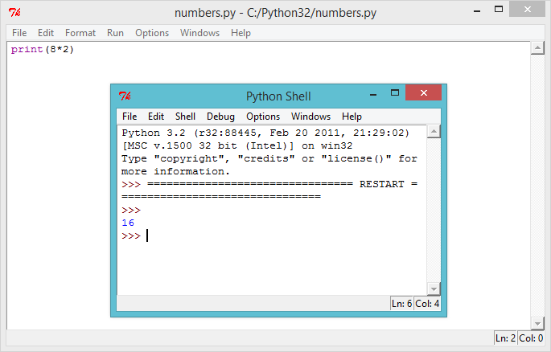
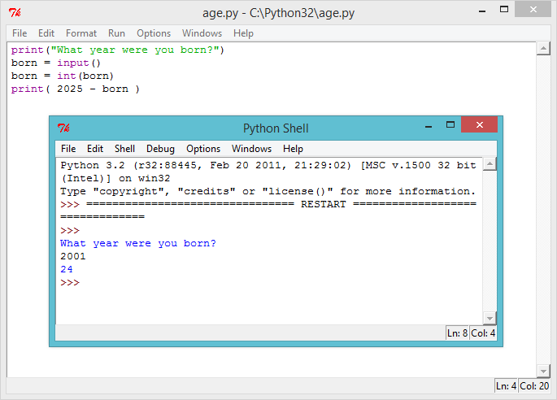
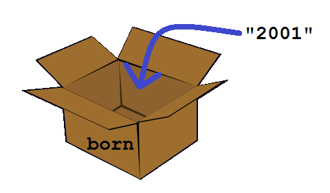
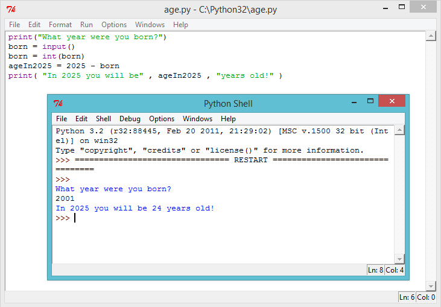
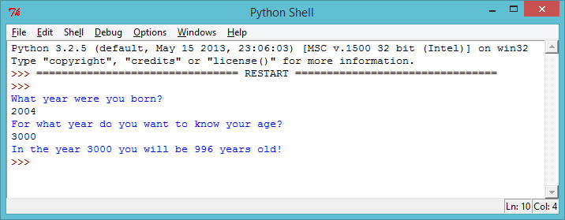

---
title: (Beta) The Year 2025
level: Term 1
language: en
stylesheet: python
embeds: "*.png"
...

#Heads up! { .beta}
This project is in Beta. That means we're still testing it, and there's a small chance there could be some bugs or typos. If you're a club leader trying out this project, please complete <a href="https://docs.google.com/forms/d/1eMCfpYe3v7eYu5M8rSqLKlmq7cczLCLHx66csgyUyVU/viewform?usp=send_form" target="_blank">this short questionnaire</a> (or email projects@codeclub.org.uk) to let us know how it went!

#Introduction:  { .intro}

You can use Python to do calculations, and make your programs more useful by using variables to store data.

#Step 1: How much? { .activity}
## Activity Checklist { .check}

+ It’s not just text that you can print in Python, you can also print numbers to the screen. For example, if 8 of your friends each gave you £2 for a sponsored silence, you can use this program to see how much money you raised:

	```{.language-python}
	print(8*2)
	```

	The star `*` in the program above is a multiply sign, so the program should print the answer to 8 x 2.

+ Run the program above, and you should see the answer:

	

## Challenge: Pocket money { .challenge}
Write a Python program to calculate how much money you’d make if you washed 12 cars, and charged £2.50 for each car.

#Step 2: How old? { .activity}
## Activity Checklist { .check}

+ With everything you've learnt so far, you should be able to write a program to calculate how old you’ll be in the year 2025. The Python program to calculate your age should work like this:

	

	As you can see, if you were born in 2004, you can calculate your age in the year 2025 by the calculation `2025 - 2004`. So someone born in 2004 will be 21 years old in the year 2025! If you weren’t born in 2004 you can change the number in the program.

## Challenge: Changing dates { .challenge}
Change your program to find out how old someone born in 1998 would be in the year 2025. How old will someone born this year be in the year 2050?

#Step 3: Variables { .activity}

When completing the challenges above, you had to keep changing the numbers in the program for people of different ages, and for different years in the future. It would be much easier if you could ask someone what year they were born, and use the answer in your calculation. That's what variables are for!

## Activity Checklist { .check}

+ Run this Python program:

	```{.language-python}
	print("What year were you born?")
	born = input()
	born = int(born)
	print( 2025 - born )
	```

	This program waits for you to type in the year you were born, and press enter. You should then see how old you'll be in the year 2025:

	

	This program uses the `input()` function to get the user's input from the keyboard, and store it in a variable called 'born', so that it can be used later. You can think of a variable as a box, which can be used to store important data.

	

	Notice that the variable (the box) has been named "born", as it helps you remember what you’re storing inside it! 

	The line...

	```{.language-python}
	print( 2025 - born )
	```

	...takes whatever number has been stored in the `born` variable away from 2025.

	Anything that is typed in from the keyboard is always stored as text, so you also have to use the `int()` function to turn the user's input into a whole number (which in programming is called an _integer_).

+ You can make your program much easier to understand, by adding a helpful message for the user, so they know what you're showing them. Change the last line of your program to:

	```{.language-python}
	print( "In 2025 you will be" , 2025 - born , "years old!" )
	```

+ Try running your program again, to see how this change looks.

	

+ But why stop there? You could also use another variable to store the answer before printing it for the user. Try this program out:

	

## Challenge: The year 3000! { .challenge}
Your program only tells people what their age will be in the year 2025. What if someone wants to know their age in the year 2050? Or the year 3000? Add another variable to your program, so that the user can find out how old they'll be in any year they choose. 



## Challenge: Your age in dog years { .challenge}
Write a program to ask the user their age, and then tell them their age in dog years! You can calculate a person’s age in dog years by multiplying their age by 7.


