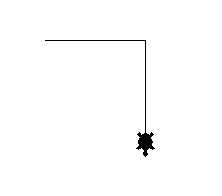
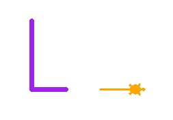
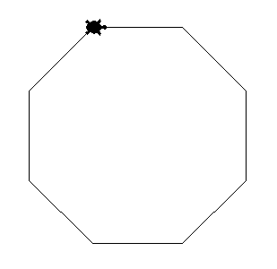

---
title: Turtle Power
level: Python 1
language: en
stylesheet: python
embeds: "*.png"
materials: ["Club Leader Resources/*.*"]
beta: true
...

#Introduction:  { .intro}
In this project, you'll learn to use *loops* to easily repeat parts of your programs.

#Step 1: Hello, turtle! { .activity}

We're going to have some fun programming turtles. A turtle is a tiny robot that draws on your screen, and can be controlled using Python commands.

## Activity Checklist { .check}

+ Let's make a turtle move around the screen, by running this short Python program:

	```{.language-python}
	from turtle import *
	shape("turtle")
	speed(5)

	forward(100)
	right(90)
	forward(100)

	done()
	```

	

+ The turtle has a pen attached, and draws a line as it moves around the screen. Here's what the program does:

	+ `from turtle import *` tells Python that you want to use the turtle library, a collection of code you can use to draw on the screen. The `*` means 'import everything'.

	+ `shape("turtle")` makes the drawing robot look like a turtle. As well as turtle, you can also use "arrow", "circle", "square", "triangle" or "classic".

	+ `speed(5)` tells the turtle how fast to draw. You can use a number between 1 and 11. 11 is the fastest, 1 is the slowest.

	+ `forward(100)` and `backward(100)` tells the turtle to move forward or backward 100 pixels.

	+ `left(45)` and `right(90)` turn the turtle left or right by a number of degrees. Here are some examples:

		

	+ `done()` tells Python that we've finished programming the turtle.


+ What's your favourite colour? To make your drawings more interesting, you can also change the colour and the size of the pen drawing the line. Here's a simple example to try:

	```{.language-python}
	from turtle import *
	shape("turtle")
	speed(8)

	color("Purple")
	pensize(7)
	right(90)
	forward(100)
	left(90)
	forward(50)

	color("Orange")
	pensize(3)
	penup()
	forward(50)
	pendown()
	forward(50)

	done()
	```

	

+ The code above contains a couple of new commands:

	+ `color("Purple")` turns the turtle and the line purple. Notice the American spelling of the word colour, which doesn't have a 'u' in it. You can also specify colours in *hex*, like you did in CSS. Instead of using `pencolor("Red")` you could use `pencolor("#FF0000")`.

	+ `penup()` lifts the pen from the screen, and `pendown()` lowers it again. This means that you can move the turtle without leaving a trail!

## Challenge: Drawing shapes { .challenge}
+ Can you use the turtle instructions above to draw:
	+ A square?
	+ A triangle?

+ Can you draw a house? What else can you draw?

# Step 2: Repeating yourself { .activity }

When drawing a square and a triangle, your program repeated the same commands over and over again. Let's get Python to repeat them for us!

## Activity Checklist { .check}

+ Open up a new file, and run the following program:

	```{.language-python}
	from turtle import *

	speed(11)
	shape("turtle")

	for count in range(4):
		forward(100)
		right(90)

	done()
	```

	This program uses a `for` loop. You can use a `for` loop in Python whenever you want to repeat some code a set number of times.

	In the program above, the commands `forward(100)` and `right(90)` are repeated 4 times, drawing a square. Turning 90 degrees for each corner means we turn 360 degrees in total.

+ Just like with an `if` statement, you should use the Tab key to indent the code that you want to repeat. Try changing the code, so that the line `forward(100)` is indented but the line `right(50)` isn't, like this:

	```{.language-python}
	from turtle import *

	speed(11)
	shape("turtle")

	for count in range(4):
		forward(100)
	right(90)

	done()
	```

	What happens when you run this program? Did you get a straight line? In this program, Python will repeat `forward(100)` four times, and _then_ turn `right(90)`.

+ Now that you know how to repeat commands, you can create complicated shapes and patterns really easily. Run this program:

	```{.language-python}
	from turtle import *

	speed(11)
	shape("turtle")

	for count in range(8):
		forward(100)
		right(45)

	done()
	```

	

	This program works in the same way as the square drawing program, except that it repeats 8 times, and only turns 45 degrees for each corner. This means that the code draws an 8-sided shape (an octagon), as the corners for each of the 8 sides add up to 360 degrees (360 divided by 8 is 45).

+ Here's another example of what can be created using a `for` loop. What does this program draw?

	```{.language-python}
	from turtle import *

	speed(11)
	shape("turtle")

	for count in range(30):
		forward(5)
		penup()
		forward(5)
		pendown()

	done()
	```

## Challenge: Loopy shapes { .challenge}
+ Can you use a `for` loop to draw:
	+ A pentagon? (five sides)
	+ A hexagon? (six sides)
Remember that the angles of all the corners always add up to 360 degrees!

+ Can you draw a circle? You can move forward 1 pixel and turn 1 degree each time. How many times would you need to repeat these commands?

## Challenge: Drawing patterns { .challenge}
Can you use what you've learnt to draw awesome patterns? Here's an example:

```{.language-python}
from turtle import *

speed(11)
shape("turtle")
pensize(6)
color("Red")

for count in range(36):
	forward(100)
	right(100)

done()
```


## Challenge: Variables and loops { .challenge}
When drawing different shapes, you had to calculate how many degrees to turn for each corner yourself.

Can you use a calculation, so that the computer works this out for you? To work out the number of degrees to turn, you can divide 360 by the number of sides in the shape:

```{.language-python}
sides = 4
angle = 360 / sides
```

`/` is the Python symbol for divide. Notice that the answer is stored in a variable called `angle`, which you can then use to draw your shape:

```{.language-python}
left(angle)
```

You can then change the number stored in the `sides` variable and test that it works for any shape!


