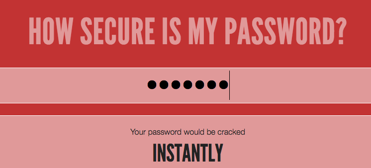
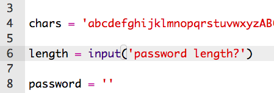

#Introduction:  { .intro}

It's important to protect your personal information online, and in this project you'll create a program to generate passwords for you.

The passwords will be random, so no one will be able to guess them!

  <iframe src="https://trinket.io/embed/python/08c0ad3359?outputOnly=true&start=result" width="600" height="500" frameborder="0" marginwidth="0" marginheight="0" allowfullscreen>
  </iframe>
  

#Step 1: How secure is your password? { .activity}

A computer could try to guess your password by using 'brute force' -- this means trying out lots of passwords until it guesses the right one.

Let's find out how long it would take a computer to guess your password.

## Activity Checklist { .check}

+ Go to <a href="https://howsecureismypassword.net/" target="_blank">howsecureismypassword.net</a>, which is a website for finding out how secure your passwords are.

	

+ Type in "letmein" (Let me in) as the password. You'll see that a computer would guess this password __instantly__!

	

	You'll also see some reasons why "letmein" isn't a good password to use:

	+ It's a very __common__ password (one of the 15 most used passwords). A computer would guess these first.

	+ It contains words from the __dictionary__. A computer would also try these passwords first.

	+ It's very __short__. It would take a computer more time to guess a longer password.

	+ It only contains __letters__. Passwords are more secure if they also contain numbers and punctuation.

+ Try entering a dictionary word. How long would it take a computer to guess that password? 

## Challenge: Creating a better password { .challenge}
Can you enter a password that would take a computer more than 1,000 years to crack but isn't too long to type?

Remember that your password is harder to guess if it's:

+ Long
+ Not a word in the dictionary
+ Contains letters, numbers and punctuation

You're going to generate passwords that are hard for a computer to crack. These are useful for protecting important accounts. Note that many adults use a password manager program to help them remember lots of tricky passwords.

#Step 2: Random characters { .activity}

Let's create a program to choose a random character for your password.

## Activity Checklist { .check}

+ Open the blank Python template Trinket: <a href="http://jumpto.cc/python-new" target="_blank">jumpto.cc/python-new</a>. 
+ Create a list of characters, stored in a variable called `chars`.

	

+ To choose a random character, you'll need to `import` the `random` module.

	

+ Now you can choose a random character from the list, and store it in a variable called `password`.

	

+ Finally, you can print your (very short!) password to the screen.

	

+ Test your project by clicking 'run'. You should see a single random character on the screen.

	

	If you run your program a few times, you should see different characters appear.

+ A password isn't very secure if it only contains letters. Add some numbers to your `chars` variable.

	

+ Test your code again a few times, and you should see that sometimes a number is chosen.

## Save your project { .save }

## Challenge: Using numbers and punctuation { .challenge}
Can you improve your program, so that it also chooses from:

+ Capital letters (A-Z)
+ Numbers (0-9)
+ Punctuation (!?.,-)

You'll need to add to your `chars` variable. Remember to test your improved program!

## Save your project { .save }

#Step 3: A random password { .activity}

A single character isn't very useful - let's improve your program to create a longer password.

## Activity Checklist { .check}

+ To create a password, you will add random characters to it, one at a time.

	To start with, your `password` variable should be empty. Add this line to your code:

	

+ You want to choose a random character 10 times. To do this, add the following code:

	

+ You should also indent (move in) the line to choose a random character, so that it happens 10 times.

	To indent, press the 'tab' key.

	

+ You need to use `+=` to __add__ the new character to the password each time.

	

+ Test your new code and you should see a password that's 10 characters long.

	

## Save your project { .save }

## Challenge: A longer password { .challenge}
Can you change your program so that it creates a verrrrrrrry long password?

## Save your project { .save }

#Step 4: Choosing a password length { .activity}

Some websites require passwords to be a certain length. Let's allow the user to choose the length of their password.

## Activity Checklist { .check}

+ First, ask the user to input a password length, and store it in a variable called `length`.

	

+ Use `int()` to turn the user's input into a whole number.

	

+ Use your `length` variable to repeat as many times as the user entered.

	

+ Test your code. The password created should be the length entered by the user.

	

## Save your project { .save }

#Step 5: Lots of passwords { .activity}

Let's allow the user to create 3 passwords at once.

## Activity Checklist { .check}

+ Add this code to create 3 passwords:

	

+ Highlight the code for creating a password, and press tab to indent so that it repeats 3 times.

	

+ Test your new code. You should now see 3 passwords of your chosen password length.

	

## Save your project { .save }

## Challenge: Choosing the number of passwords { .challenge}
Instead of always printing 3 passwords, can you allow the user to enter the number of passwords they want?

Here's how your program should work:

The code you'll need is __very__ similar to the code for entering the `length` of the password.

## Save your project { .save }