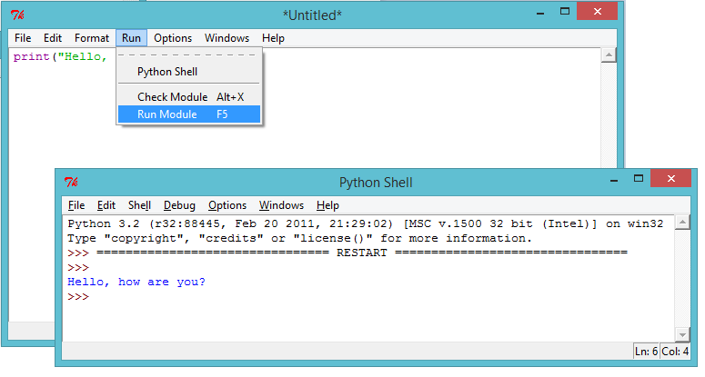
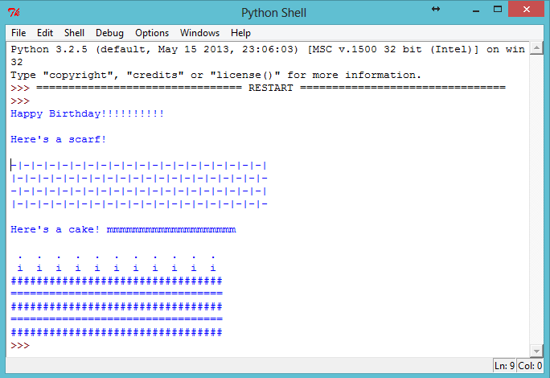

---
title: ASCII-taidetta
level: Python 1
language: fi
stylesheet: python
embeds: "*.png"
materials: ["Project Resources/*.*"]
...

#Intro:  { .intro}

Pythonilla voit muuttaa sarjan komentoja hyödyllisiksi ohjelmiksi ja hauskoiksi peleiksi! Näiden tehtävien aikana opit ajamaan Python-ohjelman, joka kirjoittaa näytölle tekstiä.

#1. askel: Tervehtiminen { .activity}
## Tehtävälista { .check}

+ Aloitetaan kirjoittamalla hyvin yksinkertainen ohjelma, jotta opit, miten Python-ohjelma saadaan käyntiin. Avaa IDLE-editori.
    + Jos käytät Windowsia, löydät IDLEn käynnistysvalikosta;
    + Jos olet Mac-tietokoneella, avaa Terminal.app, kirjoita `idle` ja paina enter;
    + Linuxilla löydät IDLEn avaamalla Terminal-ikkunan, kirjoittamalla `idle` ja painamalla enteriä;

+ Klikkaa `File → New Window` ja kirjoita seuraava teksti avautuneeseen ikkunaan:

```python
print("Hello, how are you?")
```


Tämä ohjelma tulostaa tietokoneen näytölle tekstiä. Huomaa, että teksti, jonka haluat näkyvän näytöllä, on rajattu lainausmerkeillä(`"`). Tämä kuva näyttää, mitä sinun tulee tehdä:


+ Tallenna tiedosto klikkaamalla `File → Save` ja anna sille nimeksi vaikkapa `hello.py` tai jokin muu vastaava nimi. Nimen pitää loppua `.py`, jotta tietokone ymmärtää, että kyseessä on Python-kielellä kirjoitettu tiedosto. Ilman tätä liitettä ohjelmassasi ei näy väritunnisteita, joista voi olla paljon apua.


+ Aja ohjelma valitsemalla `Run → Run Module`. Toisen ikkunan tulisi nyt avautua. Uusi ikkuna on Python-komentorivi, jossa ohjelmasi voidaan ajaa. Jos kaikki on toiminut kuten pitikin, näet nyt tekstisi tulostettuna näytölle.



+ Jos olen tehnyt jonkin virheen, esimerkiksi unohtanut lainausmerkin (`"`), saat sen sijaan virheilmoituksen, joka kertoo sinulle, mitä meni pieleen. Kokeile saada virheilmoitus!


+ Onneksi olkoon, olet nyt virallisesti Python-ohjelmoija! Voit taputtaa itseäsi olalle (tai jos sinua laiskottaa, pyydä jotakuta muuta tekemään se).

## Tallenna projektisi {.save}

## Haaste: Mitä mietit? { .challenge}
Muuta edellinen ohjelma kirjoittamaan näytölle jotakin mielenkiintoisempaa!

Jos haluat käyttää ä- ja ö-kirjaimia, sinun tulee lisätä ohjelmasi alkuun seuraava rivi: 

```python
# -*- coding: utf-8 -*-
```

Aloita tällä rivillä jokainen ohjelmasi, jossa haluat käyttää ä:tä tai ö:tä, koska ne eivät kuulu Pythonin vakiomerkistöön.


## Tallenna projektisi {.save}

#2. askel: Esittele itsesi { .activity .new-page}
## Tehtävälista { .check}

+ Tulostetaanpa näytölle jotakin paljon hauskempaa kuin tekstiä... ASCII-taidetta! ASCII-taide on kuvien luomista tekstillä. Tässä on esimerkki - se esittää koiraa!


Tehdäksesi itse tämän mestariteoksen, kirjoita seuraava IDLE-editoriin ja aja ohjelmasi:

```python
print("Kuva koirasta...")
print(" 0____  ")
print("  ||||  ")
```

+ Voit myös halutessasi käyttää kolmea heittomerkkiä (`'''`) lainausmerkkien sijasta, jolloin voit tulostaa useampia rivejä tekstiä yhdellä print-komennolla. Näin:

```python
print('''
Kuva koirasta...
0____
||||
''')
```

Kun ajat tämän ohjelman, näet saman koiran kuin edelliselläkin ohjelmalla.

## Tallenna projektisi {.save}

## Haaste: Esittele itsesi { .challenge}
Kirjoita Python-ohjelma, joka kertoo jotain sinusta, käyttäen tekstiä ja ASCII-taidetta. Voit luoda kuvia harrastuksistasi, kavereistasi, perheestäsi... mistä vain haluat! Tässä esimerkki:


## Tallenna projektisi {.save}

#3. askel: Tekstin laskemista { .activity}
## Tehtävälista { .check}

+ Python osaa myös tehdä laskutoimituksia tekstillä! Mitä saadaan, jos `"hello"` kerrotaan viidellä? Kysytään Pythonilta, ajamalla tämä ohjelma:

```python
print("hello" * 5)
```

Tähti (`*`) ohjelmassa on kertolaskun merkki. Kun ajat ylläolevan ohjelman, sinun tulisi nähdä vastaus:


+ Voit tehdä edellisestä tekstistä helpommin luettavaa, jos lisäät välilyönnin sanan `"hello"` jälkeen ohjelmassasi:

```python
print("hello " * 5)
```

Ajamalla tämän ohjelman näet, että sen tulostetta on vähän helpompaa lukea kuin aiemmin.

+ Jos `"hello "` kertaa 5 on `"hello hello hello hello hello "`, niin mitä sitten on `"hello" - 7`? Onko tässä laskutoimituksessa mitään järkeä?


Hupsista, se meni rikki! Vastauksen sijasta saimme virheilmoituksen. Näyttää siltä ettei tuossa laskussa ole järkeä Pythonilla.

+ Entä sitten yhdyslasku? Mitä luulet `"hello " +  "world"`in tulostavan? Kokeile sitä itse ajamalla seuraava ohjelma:

```python
print("hello " + "world")
```


Antaako se odottamasi vastauksen?

## Tallenna projektisi {.save}

## Haaste: Sanoja ja numeroita { .challenge}
Mitä tämä ohjelma kirjoittaa näytölle? Kokeile, pystytkö arvaamaan lopputuloksen, ennen kuin ajat ohjelman.

```python
print("ha "*4)
print("mi" + "ta"*2)
print("Hei kai" + "k"*2 + "i" + "!"*10)
```

Osaatko tehdä omia sanojasi?

## Tallenna projektisi {.save}

#4. askel: ASCII-kuvioita { .activity}
## Tehtävälista { .check}

+ Nyt osaat tehdä laskutoimituksia tekstillä, entä sitten? Onko siitä mitään hyötyä? No, sanotaan että haluaisit piirtää ASCII-suorakulmion joka on 30 merkkiä leveä ja kolme merkkiä korkea. Voisit joko tehdä sen hankalalla tavalla:

```python
print("##############################")
print("##############################")
print("##############################")
```

tai voisit säästää aikaa ja piirtää sen helpommalla tavalla, näin:

```python
print("#" * 30)
print("#" * 30)
print("#" * 30)
```

Molemmat piirtävät täsmälleen samanlaisen suorakulmion näytölle.


+ Voit tehdä laskutoimituksia käyttämällä jopa mielenkiintoisia kuvioita, kuten tämän aallon:

```python
print("/\  "*10)
print("  \/"*10)
```


## Tallenna projektisi {.save}

## Haaste: Koodaa huivi { .challenge}
Parhaalla ystävälläsi on 11-vuotissyntymäpäivä, ja olet päättänyt antaa hänelle lahjaksi huivin! Suunnittele huiviin omanlainen kuviosi käyttämällä laskutoimituksia hyväksi mahdollisimman paljon.

Jos olet anteliaalla tuulella, voit jopa koodata hänelle syntymäpäiväkakun, jossa on 11 kynttilää!



## Tallenna projektisi {.save}
