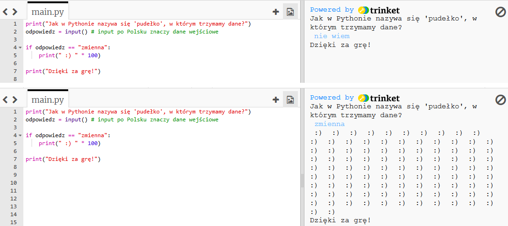
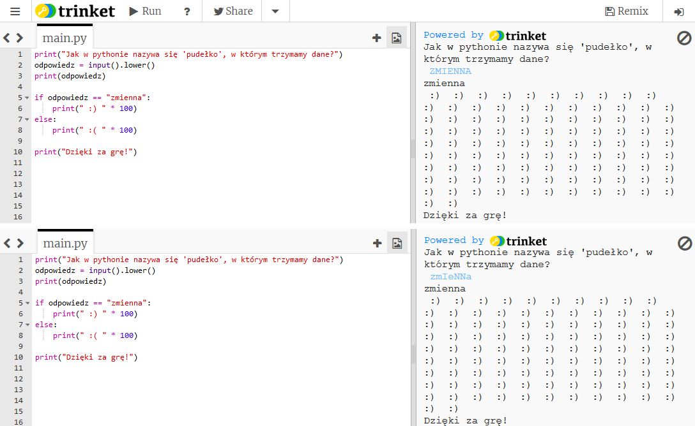
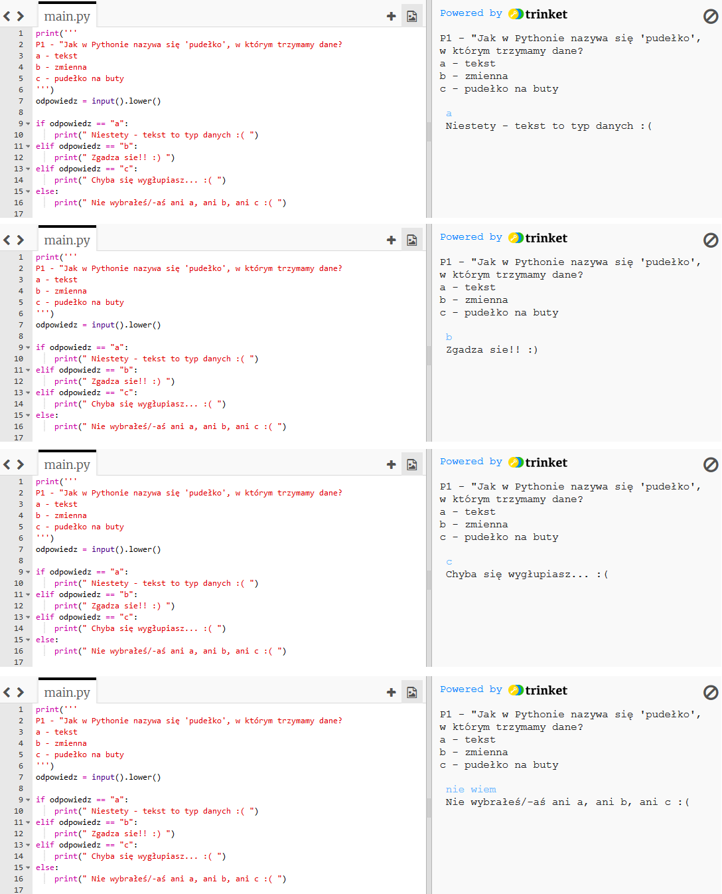

---
title: Quiz
level: Python 1
language: pl
stylesheet: python
embeds: "*.png"
materials: ["Project Resources/Quiz.py"]
...

# Wstęp:  { .intro}

W tym projekcie stworzysz quiz, którym możesz rzucić wyzwanie swoim przyjaciołom.

# Krok 1: Zadawanie pytania { .activity}

## Lista zadań { .check}

+ Zacznijmy od napisania prostego quizu, który zadaje graczowi pytanie, a potem wyświetla uśmiechnięte buźki jeśli wprowadzi on prawidłową odpowiedź.

	```python
	print("Jak w Pythonie nazywa się 'pudełko', w którym trzymamy dane?")
	odpowiedz = input()	# input po Polsku znaczy dane wejściowe

	if odpowiedz == "zmienna":
		print(" :) " * 100)

	print("Dzięki za grę!")
	```

	Pamiętaj o dodaniu dwukropka (`:`) na końcu linii `if odpowiedz == "zmienna":` i wcięciu linii poniżej (przesunięciu w prawo) spacjami.

+ Po napisaniu powyższego programu wypróbuj go! Co się stanie jeśli odpowiesz prawidłowo? Co się stanie jeśli odpowiedź będzie błędna?

	

	Kod po wcięciu (który wyświetla usmiechnięte buźki) wykonuje się tylko jeśli (`if`) odpowiedź jest poprawna. Z kolei "Dzięki za grę!" pojawia się zawsze, bez względu na to, czy odpowiedź jest poprawna czy błędna. Czy potrafisz opowiedzieć dlaczego?

	Python używa podwójnego znaku równa się	`==` do sprawdzenia, czy dwie rzeczy są takie same. Musi używać podwójnego znaku, ponieważ pojedynczy `=` jest używany do zapisania czegoś w zmiennej (na przykład `odpowiedz = input()`).

+ Program powyżej wyświetla usmiechnięte buźki jeśli gracz odpowie prawidłowo, ale nie wyświetla nic kiedy odpowiedział źle. Aby to poprawić możesz użyć komendy `else` (po polsku: `w przeciwnym wypadku`) żeby wyświetlić smutne buźki jeśli użytkownik wprowadzi cokolwiek co jest inne od prawidłowej odpowiedzi.

	```python
	print("Jak w pythonie nazywa się 'pudełko', w którym trzymamy dane?")
	odpowiedz = input()

	if odpowiedz == "zmienna":
		print(" :) " * 100)
	else:
		print(" :( " * 100)

	print("Dzięki za grę!")
	```

	Wypróbuj nowy program. Co się stanie jeśli wprowadzisz poprawną odpowiedź? Co się stanie jeśli wprowadzisz odpowiedź błędną?

	

## Zapisz Swój Projekt {.save}

## Wyzwanie: Czas na pytania { .challenge}

Korzystając z tego, czego już się nauczyłeś stwórz swój quiz. Możesz wybrać jakikolwiek temat, a twój quiz powinien używać komend `if` i `else` tak, żeby informować gracza o tym jak mu idzie.

## Zapisz Swój Projekt {.save}

# Krok 2: Testowanie { .activity}

Zawsze dobrze jest sprawdzić swoje programy, aby upewnić się, że działają jak należy.

## Lista Zadań { .check}

+ Jeśli sprawdzałeś swój program, napewno zauważyłeś, że możliwe jest otrzymanie smutnych buziek nawet jeśli została wprowadzona prawidłowa odpowiedź! Tak jak w tym przykładzie, w którym gracz przypadkowo wcisNĄŁ CAPS LOCK!

	

	Dzieje się tak dlatego, że Python jest bardzo dokładny kiedy porównuje odpowiedź gracza z odpowiedzią prawidłową. Dla Pythona "Z" to nie to samo co "z", więc jeśli gracz użył wielkich liter przy wpisywaniu odpowiedzi, Python myśli, że odpowiedź jest błędna!

	Sprawdź w swojej grze, czy dzieje się to samo.

+ Żeby rozwiązać problem, musisz zmienić znaki wpisywane przez gracza na małe litery, żeby nie było w jego odpowiedzi żadnych wielkich liter. Możemy się upewnić, że to działa przez wyświetlenie zmodyfikowanej odpowiedzi. Zmień swój program tam, gdzie gracz wpisuje swoją odpowiedź:

	```python
	odpowiedz = input().lower()
	print(odpowiedz)
	```

+ Teraz sprawdź swój quiz. Czy udało się naprawić problem? Spróbuj wprowadzić poniższe przykłady:  

	

## Zapisz Swój Projekt {.save}

# Krok 3: Wielokrotny wybów { .activity}

## Lista Zadań { .check}

+ Do tej pory używaliśmy `if` i `else` żeby dać graczowi znać, czy jego odpowiedź była prawidłowa czy nie. Co jeśli chcielibyśmy zadać pytanie z wieloma odpowiedziami, w którym gracz mógłby wybrać jedną z 4 odpowiedzi? Służy do tego komenda `elif`.

	```python
	print('''
	P1 - "Jak w Pythonie nazywa się 'pudełko', w którym trzymamy dane?
	a - tekst
	b - zmienna
	c - pudełko na buty
	''')
	odpowiedz = input().lower()

	if odpowiedz == "a":
		print(" Niestety - tekst to typ danych :( ")
	elif odpowiedz == "b":
		print(" Zgadza sie!! :) ")
	elif odpowiedz == "c":
		print(" Chyba się wygłupiasz... :( ")
	else:
		print(" Nie wybrałeś/-aś ani a, ani b, ani c :( ")
	```

	`elif` to skrót od angielskiego "else if", które po polsku oznacza "w przeciwnym wypadku jeżeli". Dlatego w programie powyżej gracz zobaczy jedną z 4 wiadomości w zależności od tego jaką dał odpowiedź.

+ Dodaj powyższy kod do swojego quizu tak, aby zawierał pytanie wielokrotnego wyboru.

+ Sprawdź to nowe pytanie na 4 sposoby tak, żebyś otrzymał każdą z 4 odpowiedzi.

	

## Zapisz Swój Projekt {.save}

## Wyzwanie: Quiz z pytaniami wielokrotnego wyboru  { .challenge}

Dodaj kilka pytań wielokrotnego wyboru do swojego programu. Kiedy skończysz, poproś kogoś o udział w grze! Jak im poszło? Czy dobrze się bawili? Czy Twój quiz był za łatwy albo za trudny?

## Zapisz Swój Projekt {.save}

## Wyzwanie: Liczenie punktów  { .challenge}

Czy potrafisz wykorzystać zmienną `punkty` w swoim programie do liczenia punktów gracza? Oto jak taka zmienna może być użyta:

+ Na początku programu, ustaw wartość zmiennej na 0.
+ Za każdym razem kiedy zostaje udzielona prawidłowa odpowiedź dodaj 1 do puntów gracza (`punkty = punkty + 1`)
+ Na końcu programu wyświetl liczbę punktów gracza.

## Zapisz Swój Projekt {.save}

## Wyzwanie: Jak mi poszło?  { .challenge}

Czy potrafisz wyświetlić osobistą wiadomość dla gracza na końcu każdej gry?

+ Powiedz "bardzo dobrze" jeśli (`if`) gracz odpowiedział prawidłowo na wszystkie pytania.
+ W przeciwnym wypadku (`else`) powiedz "jeszcze raz" jeśli którakolwiek odpowiedź była błędna.

(Bedziesz potrzebował zmiennej `punkty`, żeby zdecydować, którą wiadomość wyświetlić!)

## Zapisz Swój Projekt {.save}
