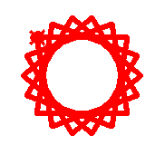

---
title: Żółwiowa Moc
level: Python 1
language: pl
stylesheet: python
embeds: "*.png"
materials: ["Club Leader Resources/*.*"]
...

#Wprowadzenie:  { .intro}
W tym projekcie nauczysz się jak rysować fantastyczne wzory i kształty za pomocą 'żółwia' (z angielskiego 'turtle').

#Krok 1: Cześć, żółwiu! { .activity}

Dziś zabawimy się w programowanie żółwi. Żółw to mały robot, który rysuje na ekranie i może być kontrolowany za pomocą komend w Pythonie.

## Lista zadań { .check}

+ Uruchamiając ten krótki program, sprawimy, że żółw będzie poruszał się po ekranie:

	```python
	from turtle import *
	shape("turtle")
	speed(5)

	forward(100)
	right(90)
	forward(100)

	done()
	```

	

+ Żółw ma przyczepiony długopis i rysuje linię poruszając się. Oto, co dokładnie robi ten program:

	+ `from turtle import *` mówi Pythonowi, że chcesz wykorzystać bibliotekę z żółwiem (po angielsku 'turtle' to żółw), która jest kolekcją kodu który pozwala na rysowanie po ekranie. Symbol `*` oznacza 'zaimportuj wszystko'.

	+ `shape("turtle")` sprawia, że rysujący robot ma kształt żółwia (po angielsku 'shape' oznacza kształt). Zamiast żółwia możesz wybrać "strzałkę" ("arrow"), koło ("circle"), "kwadrat" ("square"), "trójkąt" ("triangle") lub "wygląd klasyczny" ("classic").

	+ `speed(5)` mówi żółwiowi jak szybko ma rysować. Możesz wybrać liczby od 1 do 11. 11 to najszybciej, 1 to najwolniej.

	+ `forward(100)` i `backward(100)` mówi żółwiowi, żeby przesunął się w przód (forward oznacza "do przodu") lub w tył ("backwards" to po angielsku "do tyłu") o 100 pikseli. 

	+ `left(45)` and `right(90)` skręca żółwiem w lewo lub w prawo o zadaną ilość stopni. Oto kilka przykładów:

		

	+ `done()` (z angielskiego - "skończone") mówi Pythonowi, że zakończyliśmy programowanie żółwia.


+ Jaki jest twój ulubiony kolor? Aby urozmaicić twoje rysunki możesz również zmienić kolor i rozmiar długopisu którym rysowana jest linia. Oto prosty przykład do wypróbowania:

	```python
	from turtle import *
	shape("turtle")
	speed(8)

	color("Purple")
	pensize(7)
	right(90)
	forward(100)
	left(90)
	forward(50)

	color("Orange")
	pensize(3)
	penup()
	forward(50)
	pendown()
	forward(50)

	done()
	```

	

+ Kod powyżej ma kilka nowych komend:

	+ `color("Purple")` zmienia kolor żółwia i linii na purpurowy. Poza angielskimi nazwami kolorów możesz również użyć kodów kolorów w stylu szesnastkowym ("hex") tak jak podczas zajęć z CSS-a. Zamiast ustawiać kolor przez `pencolor("Red")` ustawiasz go komendą `pencolor("#FF0000")`.

	+ `penup()` podnosi długopis z ekranu, a `pendown()` ponownie go opuszcza. Pozwala to na przemieszcznie żółwia bez pozostawiania śladu!

## Zapisz Swój Projekt {.save}

## Wyzwanie: Rysowanie kształtów { .challenge}
+ Czy umiesz, korzystając z poprzednich instrukcji dla żółwia, narysować:
	+ Kwadrat?
	+ Trójkąt?

+ Czy umiesz narysować dom? Co jeszcze umiesz narysować?

## Zapisz Swój Projekt {.save}

# Krok 2: Powtarzanie { .activity }

Kiedy rysowałeś kwadrat lub trójkąt, twój program powtarzał te same komendy w kółko. Spróbujmy ustawić Pythona tak, żeby powtarzał komendy za nas!

## Lista zadań { .check}

+ Stwórz nowy plik i uruchom program:

	```python
	from turtle import *

	speed(11)
	shape("turtle")

	for licznik in range(4):
		forward(100)
		right(90)

	done()
	```

	Ten program korzysta z pętli `for`. Możesz używać pętli `for` w Pythonie kiedy chcesz, żeby ten sam kod powtórzył się określoną ilość razy.

	W programie powyżej, komendy `forward(100)` i `right(90)` są powtórzone 4 razy podczas rysowania kwadratu. Obrót o 90 stopni w każdym rogu oznacza, że w sumie żółw obróci się o 360 stopni.

+ Tak samo jak z wyrażeniem `if` (`jeżeli`), trzeba skorzystać z klawisza Tab do wcięcia kodu, który ma zostać powtórzony. Spróbuj zmienić kod tak, aby linia `forward(100)` była wcięta, ale linia `right(50)` już nie, o tak:

	```python
	from turtle import *

	speed(11)
	shape("turtle")

	for licznik in range(4):
		forward(100)
	right(90)

	done()
	```

	Co się stanie kiedy uruchomisz ten program? Czy narysowana linia jest prosta? W tym programie, Python powtórzy `forward(100)` cztery razy, a dopiero _potem_ wykona obrót `right(90)`.

+ Teraz, kiedy już wiesz jak powtarzać komendy, możesz w prosty sposób zacząć tworzyć skomplikowane kształty. Uruchom ten program:

	```python
	from turtle import *

	speed(11)
	shape("turtle")

	for licznik in range(8):
		forward(100)
		right(45)

	done()
	```

	

	Ten program działa tak samo, jak program rysujący kwadraty, z wyjątkiem tego że powtarza 8 razy i obraca się o 45 stopni w każdym rogu. To oznacza, że rysuje on figurę 8-boczną (ośmiobok), ponieważ kąty pomiędzy ośmiu ścianami sumują się do 360 stopni (360 podzielone na 8 to 45).

+ Oto kolejny przykład tego, co można stworzyć z pomocą pętli `for`. Co rysuje następny program?

	```python
	from turtle import *

	speed(11)
	shape("turtle")

	for licznik in range(30):
		forward(5)
		penup()
		forward(5)
		pendown()

	done()
	```

## Zapisz Swój Projekt {.save}

## Wyzwanie: Pętlowe kształty { .challenge}
+ Czy umiesz użyć pętli `for` do narysowania:
	+ Pięcioboku? (pięć ścian)
	+ Sześcioboku? (sześć ścian)
Pamiętaj, że kąty obrotów w każdym z rogów zawsze sumują się do 360 stopni!.

+ Czy umiesz narysować koło? Możesz poruszać się w przód o 1 piksel i skręcać o 1 stopień za każdym razem. Ile razy musiałbyś powtórzyć te komendy?

## Zapisz Swój Projekt {.save}

## Wyzwanie: Rysowanie wzorów { .challenge}
Czy korzystając z tego, czego nauczyliśmy się do tej pory możemy narysować fantastyczne kształty? Oto przykład:

```python
from turtle import *

speed(11)
shape("turtle")
pensize(6)
color("Red")

for licznik in range(36):
	forward(100)
	right(100)

done()
```



## Zapisz Swój Projekt {.save}

## Wyzwanie: Zmienne i pętle { .challenge}
Kiedy rysujesz różne kształty, trzeba obliczyć o ile stopni skręcić.

Czy umiesz wykorzystać obliczenia tak, żeby komputer pracował dla ciebie? Żeby obliczyć o ile stopni zakręcić, możesz podzielić 360 przez ilość ścian w figurze:

```python
ilosc_scian = 4
kat = 360 / ilosc_scian
```

`/` to symbol dzielenia w Pythonie. Zauważ, że odpowiedź jest zapisywana do zmiennej `kat` (kąt), która może być potem użyta do narysowania twojego kształtu:

```python
left(kat)
```

Możesz teraz zmienić wartość zapisaną w zmiennej `ilosc_scian` i przekonać się, czy działa dla każdego kształtu!

## Zapisz Swój Projekt {.save}
