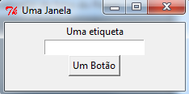
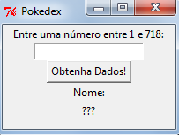
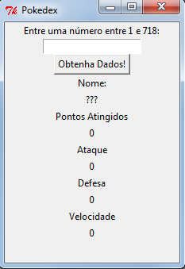
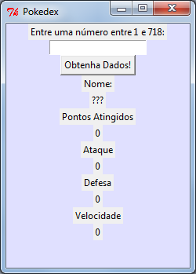
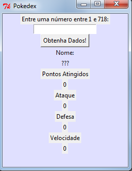
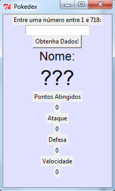
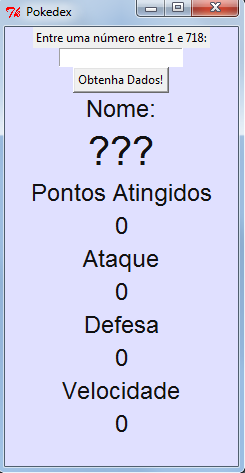
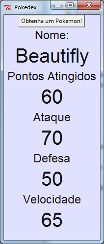
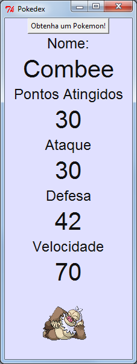

---
title: Pokedex
level: Python 2
language: pt-BR
stylesheet: python
embeds: "*.png"
materials: ["Recursos de Projeto/*.*","Recursos de Líderes de Clube/*.*"]
...

#Introdução:  { .intro}
Neste projeto você aprenderá como criar uma interface gráfica de usuário(GUI), através da criação de um Pokedex (que é um programa para procurar informações em um Pokemon).

É assim que sua GUI Pokedex vai aparentar:


## Dados do Pokemon { .challenge }
Os dados do Pokemon a serem usados neste projeto podem ser acessados através de <a href="http://pokeapi.co/">pokeAPI</a>. Eles foram criados por Paul Hallett.

#Step 1: Widgets! { .activity}
## Lista de atividades { .check}

+ A interface gráfica de usuário (GUIs) poder ser criada facilmente usando o módulo 'tkinter'. Uma GUI contém muitas "coisas" diferentes, chamadas _widgets_. Por exemplo:

    ```python
	from tkinter import *

	#criação de uma nova janela GUI
	janela = Tk()
	janela.title("Uma Janela")

	#uma etiqueta
	lbl = Label(janela,text="Uma etiqueta")
	lbl.pack()

	#uma caixa de entrada de texto 
	texto = Entry(janela)
	texto.pack()

	#um botão
	btn = Button(janela,text="Um Botão")
	btn.pack()

	janela.mainloop()
    ```

    Se você executar este programa, você verá uma janela principal, que contém uma etiqueta de texto, uma caixa de entrada de texto e um botão.

    

	Cada widget é criado e armazenado em uma variável, e depois empacotado em uma janela principal. Perceba que quando estiver criando um widget, você tem que dizer em qual janela você quer que ele apareça, e qual texto será mostrado, assim:

    ```python
 	#uma etiqueta
	lbl = Label(janela,text="Uma etiqueta")
    ```

+ Agora você pode acrescentar mais widgets para seu Pokedex:

    ```python
	from tkinter import *

	#crie uma nova janela GUI 
	janela = Tk()
	janela.title("Pokedex")

	#uma etiqueta contendo as instruções
	EtiquetaDeInstrucoes = Label(janela,text="Entre uma número entre 1 e 718:")
	EtiquetaDeInstrucoes.pack()

	#uma caixa de entrada de texto para digitar o número do pokemon
	txtPokemonNo = Entry(janela)
	txtPokemonNo.pack()

	#um botão que vai obter a informação para o pokemon
	btnObterInfo = Button(janela,text="Obtenha Dados!")
	btnObterInfo.pack()

	#etiquetas para o nome do pokemon
	etiquetaTextoNome = Label(janela,text="Nome:")
	etiquetaTextoNome.pack()
	etiquetaValorNome = Label(janela,text="???")
	etiquetaValorNome.pack()

	janela.mainloop()
    ```

    

	Perceba que vários comentários úteis foram adicionados para te lembrar para quê cada widget é usado. O nome das variáveis dos widgets também foram alteradas para tornar o programa mais fácil de ser entendido.
    
## Salve Seu Projeto {.save}

## Desafio: Mais widgets { .challenge}
Você consegue terminar de criar a interface GUI para que ela mostre os detalhes do Pokemon e para que ela fique com essa aparência:



Sua interface GUI precisará de:
+ Uma caixa de entrada de texto para digitar qual Pokemon você quer ver;
+ Um botão para obter as informações do Pokemon;
+ Várias etiquetas para mostrar as informações do Pokemon:
    + Nome;
    + Pontos Atingidos;
    + Ataque;
    + Defesa;
    + Velocidade.

Lembre-se que se você acrescentar comentários e utilizar nomes de variáveis significativos, isto te ajudará bastante mais tarde!

## Salve Seu Projeto {.save}

#Step 2: Customizando seus widgets { .activity}

Agora que você já tem vários widgets diferentes na sua janela GUI, você pode mudar a aparência deles. 

## Lista de Atividades { .check}

+ Primeiro vamos mudar algumas cores para que os widgets fiquem mais interessantes. Mude o código que que mostra a janela principal:

    ```python
    #crie uma nova janela GUI
    janela = Tk()
    janela.config(bg="#e0e0ff")
    janela.title("Pokedex")
    ```

    

    A utilização de `.config()` permite que você _configure_ a aparência das coisas. Em inglês, `bg` significa "background", ou seja, plano de fundo  e `"#e0e0ff"` é o código hexa para roxo claro. Você também pode configurar a aparência dos widgets, por exemplo, as etiquetas para mostrar o nome do Pokemon:

    ```python
	#etiquetas para o nome do pokemon
	etiquetaTextoNome = Label(janela,text="Nome:")
	etiquetaTextoNome.config(bg="#e0e0ff", fg="#111111")
	etiquetaTextoNome.pack()
	etiquetaValorNome = Label(janela,text="???")
	etiquetaValorNome.config(bg="#e0e0ff", fg="#111111")
	etiquetaValorNome.pack()
    ```

    

    `fg` significa em inglês foreground, e em português, significa primeiro plano. Com ele você ajusta a cor da etiqueta de texto.

+ Em seguida, você pode mudar a fonte de cada um dos widgets. Primeiro você pode criar variáveis para armazenar informações de diferentes fontes. Adicione este código ao seu programa logo após a linha que importa o módulo `tkinter`:

    ```python
	fontePequena = ["Helvetica" , 14]
	fonteMedia = ["Helvetica" , 18]
	fonteGrande = ["Helvetica" , 30]
    ```

    Você pode agora escolher a fonte de cada widget, desta maneira:

    ```python
	#etiquetas para o nome do pokemon
	etiquetaTextoNome = Label(janela,text="Nome:")
	etiquetaTextoNome.config(bg="#e0e0ff", fg="#111111", font=fonteMedia)
	etiquetaTextoNome.pack()
	etiquetaValorNome = Label(janela,text="???")
	etiquetaValorNome.config(bg="#e0e0ff", fg="#111111", font=fonteGrande)
	etiquetaValorNome.pack()
    ```

    Na modificação acima, a única coisa que foi acrescentada ao  `.config()` foi  `font=fonteMedia` and `font=fonteGrande`.

    

## Salve Seu Projeto {.save}

## Desafio: Fazendo com que os widgets fiquem mais bonitos { .challenge}
Você consegue acrescentar fontes e cores para melhorar a aparência da GUI do seu Pokedex. Veja aqui um exemplo de como ele pode ficar:



Seu Pokedex pode ter uma aparência diferente desta. Você pode usar diferentes fontes, por exemplo `Times`, `Courier`, ou qualquer outra fonte instalada no seu computador. Você também pode escolher suas próprias <a href="https://www.tcl.tk/man/tcl8.6/TkCmd/colors.htm">cores</a> (incluindo <a href="http://www.colorpicker.com/">código hexadecimal de cores</a>).

## Salve Seu Projeto {.save}

#Step 3: Adicionando comandos { .activity }

Agora que você tem uma GUI com uma aparência fantástica, vamos fazer um botão que realmente mostre os dados do Pokemon!

## Lista de Atividades { .check}

+ Primeiro, tenha certeza que você tem um arquivo chamado `pokeapi.py` salvo no mesmo diretório do seu programa de interface GUI do Pokedex. Peça ajuda ao líder do seu clube se você não conseguir encontrar o arquivo. Este arquivo contém uma função chamada `getPokemonData()`, que obtém todos os dados de um Pokemon específico. Para usar esta função, você tem apenas que importá-lo do arquivo `pokeapi.py`, para isto, acrescente este código no início do seu programa:

    ```python
    from pokeapi import *
    ```

+ Vamos criar uma nova função chamada `mostreDadosDoPokemon()`, que irá usar a função `getPokemonData()` que você acabou de importar. Esta função obterá os dados do Pokemon escolhido, e colocará os dados nas etiquetas da GUI. Coloque este código mais próximo do início do programa:

    ```python
    #função para mostrar dados para um número de pokemon
    def mostreDadosDoPokemon():
    	#capture o número digitado na caixa de entrada
    	numeroDoPokemon = txtPokemonNo.get()
    	
    	#use a função encontrada em 'pokeapi.py' para obter os dados do pokemon
    	dicionarioDoPokemon = getPokemonData(numeroDoPokemon)

    	#pegue os dados do dicionário e os utilize nas etiquetas
    	etiquetaValorNome.configure(text = dicionarioDoPokemon["name"])
    	etiquetaValorAtingidos.configure(text = dicionarioDoPokemon["hp"])
    ```

	Não se preocupe em como a função `getPokemonData()` funciona. Tudo que você precisa saber é que a função _retorna_ (te dá) um dicionário. Ele é então usado dentro da função `mostreDadosDoPokemon()` para mostrar os dados nas etiquetas  `name` e `hp`.
    
+ Agora que você tem as funções que você precisa, você pode adicionar o comando ao botão:

    ```python
    #um botão que vai obter a informação para um pokemon
    btnObterInfo = Button(janela,text="Obtenha dados!", command=mostreDadosDoPokemon)
    ```

    Agora tente digitar um número na caixa de entrada de texto e veja o que acontece:

    

+ Você pode até mesmo fazer um jogo de Top Pokemon, para isto basta remover o widget the entrada de texto e, ao invés disto pegar um Pokemon aleatório a cada vez. Apenas mude a função `mostreDadosDoPokemon()` para:

    ```python
    #função para mostrar dados para um número de pokemon
    def mostreDadosDoPokemon():
    	#obtenha um número aleatório de pokemon 
    	numeroDoPokemon = randint(1,718)

    	#(o restante da função continua o mesmo...)
    ```

	Lembre-se de importar o módulo `random` no início do seu programa (`from random import *`). Você pode competir com um amigo, comparando quem obteve o maior número para uma habilidade particular.
    
## Salve Seu Projeto {.save}

## Desafio: Terminar o seu Pokedex { .challenge}
+ Adicione código à sua função  `mostreDadosDoPokemon()` para mostrar o ataque, a defesa e a velocidade do Pokemon. Você precisará saber que as chaves do dicionário são:
	+ Ataque - `dicionarioDoPokemon["attack"])`
	+ Defesa - `dicionarioDoPokemon["defense"])` (perceba que a ortografia do inglês americano é utilizada!)
	+ Velocidade - `dicionarioDoPokemon["speed"])`

+ Se você preferir, você pode até mesmo mudar (ou acrescentar) os dados que são mostrados para cada Pokemon. Você também pode mostrar `"happiness"`, `"height"`, `"weight"` e muitas outras características. Você pode usar <a href="http://pokeapi.co/">este site</a> para ver todos os dados de Pokemon.



## Salve Seu Projeto {.save}

#Step 4: (Opcional) Acrescentando uma imagem { .activity }

Também é possível mostrar a foto do Pokemon selecionado no seu Pokedex!


## Nota { .challenge }
Você só pode completar este passo se você tiver o módulo 'pillow' instalado no seu computador. Se você não tem certeza, pergunte ao seu líder de clube.

## Lista de Atividades { .check}

+ É um pouco difícil mostar a imagem de um Pokemon no seu Pokedex, mas não se preocupe - existe uma função `getPokemonImage()` no arquivo `pokeapi.py` para fazer o trabalho difícil para você! Esta função obtém a imagem do Pokemon, que pode ser mostrada em uma etiqueta. Primeiro, vamos criar uma etiqueta para mostrar a imagem dentro. Adicione este código em algum ponto do seu programa principal, juntamente com as outras etiquetas:

    ```python
    #etiqueta para a imagem do seu pokemon
    etiquetaImage = tkinter.Label(janela)
    etiquetaImage.config(bg="#e0e0ff", fg="#111111")
    etiquetaImage.pack()
    ```

+ Você pode modificar a função `mostreDadosDoPokemon()` para mostrar também a imagem:

    ```python
	#função para mostrar dados para um número de pokemon
    def mostreDadosDoPokemon():
        #obtenha um número aleatório de pokemon 
        numeroDoPokemon = randint(1,178)

        #use a função acima para obter os dados e a imagem do pokemon 
        dicionarioDoPokemon = getPokemonData(numeroDoPokemon)
        imagemDoPokemon = getPokemonImage(numeroDoPokemon)

        #pegue os dados do dicionário e os utilize nas etiquetas
        etiquetaValorNome.configure(text = dicionarioDoPokemon["name"])
		etiquetaValorAtingidos.configure(text = dicionarioDoPokemon["hp"])
		etiquetaValorAtaque.configure(text = dicionarioDoPokemon["attack"])
		etiquetaValorDefesa.configure(text = dicionarioDoPokemon["defense"])
		etiquetaValorVelocidade.configure(text = dicionarioDoPokemon["speed"])
        
        #adicione a imagem e coloque-a na etiqueta
        etiquetaImage.configure(image=imagemDoPokemon)
        etiquetaImage.image = imagemDoPokemon
    ```

+ Quando você rodar seu programa e clicar em "Obtenha um Pokemon!" você verá também uma imagem!

    

## Salve Seu Projeto {.save}